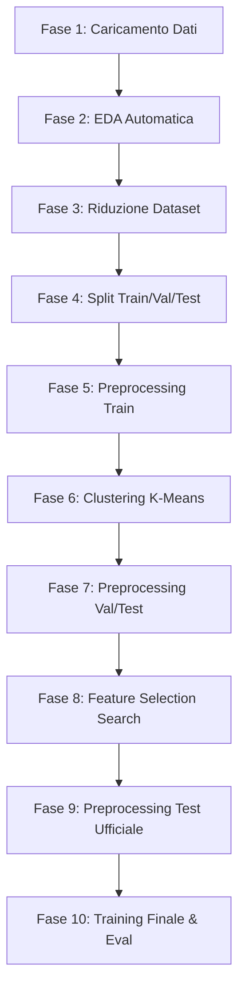

# 🏔️ Richter's Predictor — Earthquake Damage Prediction

> Algoritmo di intelligenza artificiale per la predizione del livello di danno subito dagli edifici durante il terremoto di Gorkha (Nepal, 2015).
> Sviluppato come progetto per il corso di Fondamenti di Intelligenza Artificiale (FIA).

**Fonte competizione:**
DrivenData. (2019). *Richter's Predictor: Modeling Earthquake Damage.*
https://www.drivendata.org/competitions/57/nepal-earthquake/

---

## 📝 Descrizione del problema

L'obiettivo è predire la variabile **`damage_grade`**, che rappresenta il livello di danno subito da un edificio a seguito del terremoto di Gorkha. Si tratta di un problema di **classificazione multi-classe ordinale** su tre livelli:

| Damage Grade | Descrizione |
| :---: | :--- |
| **1** | Danno lieve / strutturalmente sicuro |
| **2** | Danno medio / riparabile |
| **3** | Distruzione quasi totale / inagibile |

La metrica ufficiale di valutazione della competizione è la **micro-averaged F1 score**. Il benchmark di riferimento su DrivenData è di circa **0.75**.

---

## ⚙️ Requisiti e installazione

**Python richiesto:** >= 3.10 (consigliato 3.12/3.14)

### Installazione delle dipendenze

Dalla root directory del progetto, installare le dipendenze necessarie:

```bash
pip install -r requirements.txt
```

Le librerie principali includono: `scikit-learn`, `pandas`, `numpy`, `matplotlib`, `seaborn`, e `joblib`.

---

## 📊 Struttura dei dati

Il dataset originale contiene **39 colonne**: `building_id` (identificatore univoco) e 38 feature predittive.

### Feature principali

| Feature | Tipo | Descrizione | Valori / Range |
| :--- | :---: | :--- | :--- |
| `geo_level_1_id` | Int | Regione geografica più ampia | 0 – 30 |
| `geo_level_2_id` | Int | Sotto-regione intermedia | 0 – 1427 |
| `geo_level_3_id` | Int | Sotto-regione più specifica | 0 – 12567 |
| `count_floors_pre_eq` | Int | Numero di piani prima del terremoto | Intero |
| `age` | Int | Età dell'edificio in anni | Intero |
| `area_percentage` | Int | Area normalizzata dell'edificio | Intero |
| `height_percentage` | Int | Altezza normalizzata dell'edificio | Intero |
| `land_surface_condition` | Cat | Condizione della superficie del terreno | n, o, t |
| `foundation_type` | Cat | Tipo di fondamenta | h, i, r, u, w |
| `roof_type` | Cat | Tipo di tetto | n, q, x |
| `ground_floor_type` | Cat | Tipo di piano terra | f, m, v, x, z |
| `other_floor_type` | Cat | Tipo costruttivo dei piani superiori | j, q, s, x |
| `position` | Cat | Posizione dell'edificio | j, o, s, t |
| `plan_configuration` | Cat | Configurazione planimetrica | a, c, d, f, m, n, o, q, s, u |
| `legal_ownership_status` | Cat | Status legale di proprietà del terreno | a, r, v, w |
| `count_families` | Int | Numero di famiglie nell'edificio | Intero |
| `has_superstructure_*` | Binary | Materiali di costruzione della sovrastruttura (11 colonne) | 0 / 1 |
| `has_secondary_use_*` | Binary | Uso secondario dell'edificio (10 colonne) | 0 / 1 |

---

## 🛠️ Pipeline di Preprocessing e ML (`main.py`)

L'esecuzione del file principale coordina una pipeline end-to-end avanzata, strutturata in **10 Fasi distinte** per garantire la robustezza delle predizioni ed evitare qualsiasi fenomeno di *data leakage*.

```bash
python codice/main.py
```

In alternativa, dalla root del repository:

```bash
python -m codice.main
```

### Le 10 Fasi della Pipeline:



#### ── FASE 1: Caricamento Dati
Caricamento e unione di `Train_Values.csv` e `Train_Labels.csv` sulla chiave primaria `building_id`.

#### ── FASE 2: Analisi Esplorativa (EDA)
Generazione automatica di grafici statistici (es. distribuzione del target, correlazioni, grafici di dispersione) salvati in `output/grafici/`.

#### ── FASE 3: Riduzione Dataset (Interattiva)
Un sistema di sicurezza analizza la RAM occupata dal dataset. L'utente può scegliere in modo interattivo se proseguire con il dataset completo (260.601 record) o indicare un limite in MB. In tal caso, viene eseguito un **campionamento stratificato** che riduce le dimensioni preservando esattamente le proporzioni originarie delle classi del target.

#### ── FASE 4: Partizionamento Rigoroso
Suddivisione del dataset in:
* **Train Set** (70%) — Utilizzato per calcolare statistiche, addestrare scaler, imputer e modelli.
* **Validation Set** (15%) — Utilizzato per l'ottimizzazione degli iperparametri e la selezione del modello.
* **Test Set Interno** (15%) — Destinato esclusivamente alla valutazione finale delle performance *unseen*.

#### ── FASE 5: Preprocessing del Train Set (`data_pipeline/`)
* **Pulizia (`data_cleaning.py`)**: Rimozione di duplicati; correzione di range numerici anomali (es. `age > 800` o negativi convertiti in NaN); gestione dei record con target nullo o con oltre il 30% di valori mancanti.
* **Imputazione (`data_imputation.py`)**: Feature numeriche imputate con la mediana (`SimpleImputer` con strategia `median`); feature binarie e categoriche imputate con la moda (`SimpleImputer` con strategia `most_frequent`).
* **Encoding (`data_encoding.py`)**: Trasformazione delle 8 variabili categoriali in colonne dummy (One-Hot Encoding).
* **Standardizzazione (`data_standardization.py`)**: Scalatura con `StandardScaler` (media 0, deviazione standard 1) delle feature continue.

#### ── FASE 6: Feature Engineering tramite Clustering K-Means
Addestramento dell'algoritmo K-Means solo sulle feature continue standardizzate del Train (`age`, `area_percentage`, `height_percentage`, `count_floors_pre_eq`, `count_families`). Il numero ottimale di cluster viene supportato visivamente dall'Elbow Method (grafico `clustering_elbow.png`). Ad ogni record vengono poi aggiunte al dataset preprocessato completo le colonne dummy rappresentanti il cluster di appartenenza (`cluster_0` ... `cluster_4`), arricchendo lo spazio delle feature.

#### ── FASE 7: Preprocessing & Clustering su Validation e Test Interno
I dataset di Validation e Test vengono processati riutilizzando **esclusivamente gli estimatori precedentemente addestrati sul Train** (scaler, imputer, clusterer), garantendo l'assoluta assenza di *data leakage*.

#### ── FASE 8: Feature Selection & Hyperparameter Search (`model_evaluation/validation.py`)
Esecuzione di una ricerca combinatoria casuale condizionale (`FeatureSelectionSearch`, invocata da `main.py` con **10 iterazioni** e **Cross-Validation su 3 fold**):
* **Selettori provati**: AllFeatures baseline, Mutual Information, ReliefF, selezione embedded con Decision Tree, e SequentialFeatureSelector (SFS).
* **Classificatori ottimizzati**: Random Forest, AdaBoost, e K-Nearest Neighbors (KNN).
* **Barra di Caricamento Personalizzata**: Per evitare l'output caotico di Joblib a terminale, viene utilizzata una barra di progresso testuale personalizzata (`SimpleProgressBar`) ad alta precisione con timer integrato.
Al termine, i dataset vengono filtrati includendo solo il miglior set di feature individuato e i risultati della ricerca vengono salvati in `feature_selection_results.csv`.

#### ── FASE 9: Preprocessing del Test Ufficiale DrivenData
Il dataset ufficiale di competizione (`Test_Values.csv`) viene caricato, ripulito, imputato, codificato, arricchito con le feature di cluster e filtrato con lo stesso sottoinsieme di feature finali. Viene salvato come `test_ufficiale_finale.csv`.

#### ── FASE 10: Training Finale e Valutazione Complessiva (`model_evaluation/train_model.py`)
Addestramento del miglior modello emerso dalla Fase 8 su tutto il Train finale. 
* **Salvataggio Condizionale**: Il modello viene serializzato in `model_finale.pkl` **solo se** la Micro-F1 ottenuta sul Validation Set supera il punteggio massimo registrato nelle esecuzioni precedenti.
* **Valutazione Dettagliata**: Calcolo e salvataggio automatico di metriche, report testuali e grafici di performance (Confusion Matrix normalizzata, Curve ROC One-vs-Rest, Bar Chart di Precision/Recall/F1) separatamente per Validation e Test interno.
* **Generazione Submission**: Creazione di `submission.csv` pronto da caricare su DrivenData.

---

## 📁 Struttura della Cartella `output/`

A seguito della riorganizzazione, l'albero di output si presenta strutturato per scopi specifici:

```
output/
├── dataset/
│   ├── train_processato.csv          # Dati train preelaborati prima della selezione feature
│   ├── val_processato.csv            # Dati validation preelaborati prima della selezione feature
│   ├── test_processato.csv           # Dati test interni preelaborati prima della selezione feature
│   ├── train_finale.csv              # Dati train ridotti alle sole feature selezionate
│   ├── val_finale.csv                # Dati validation ridotti alle sole feature selezionate
│   ├── test_finale.csv               # Dati test interni ridotti alle sole feature selezionate
│   └── test_ufficiale_finale.csv     # Dataset ufficiale di test pronto per la predizione finale
├── grafici/
│   ├── eda_*.png                     # Grafici generati dall'analisi esplorativa (EDA)
│   └── clustering_elbow.png          # Grafico del metodo dell'Elbow per K-Means
├── risultati/
│   ├── feature_selection_results.csv # Tabella CSV contenente tutte le combinazioni provate nella ricerca
│   ├── model_finale.pkl              # Modello ottimale addestrato serializzato con joblib
│   ├── model_finale_best_micro_f1.txt# Score Micro-F1 di riferimento per il salvataggio condizionale
│   └── submission.csv                # File contenente le predizioni finali in formato DrivenData
└── eval/
    ├── validation/                   # Metriche e grafici delle performance sul Validation Set
    └── test/                         # Metriche e grafici delle performance sul Test Set Interno
```

---

## 🚀 Esecuzione Manuale del Modello Finale (`train_model.py`)

Oltre al flusso automatico di `main.py`, è possibile addestrare, valutare e generare la submission per un modello specifico direttamente da riga di comando passando argomenti CLI personalizzati.

```bash
python codice/model_evaluation/train_model.py --model rf --n-estimators 300 --max-depth 15
```

Forma equivalente da modulo:

```bash
python -m codice.model_evaluation.train_model --model rf --n-estimators 300 --max-depth 15
```

### Parametri CLI Disponibili:

| Parametro | Descrizione | Valori supportati (Default) |
| :--- | :--- | :--- |
| `--model` | Seleziona il tipo di algoritmo da addestrare | `rf` (Random Forest), `knn` (K-Nearest Neighbors), `ada` (AdaBoost) |
| `--output-dir` | Cartella principale per il salvataggio degli output | Percorso stringa (`../output`) |
| `--no-proba` | Disabilita il calcolo delle probabilità di classe (ROC curves) | Flag presente/assente |
| `--n-estimators` | Numero di alberi/stimatori (RF / AdaBoost) | Intero (`300`) |
| `--max-depth` | Profondità massima degli alberi (RF) | Intero / `None` (`None`) |
| `--min-samples-leaf`| Numero minimo di campioni in una foglia (RF) | Intero (`1`) |
| `--class-weight` | Criterio di peso delle classi (RF) | `balanced`, `balanced_subsample`, `None` (`None`) |
| `--n-neighbors` | Numero di vicini (KNN) | Intero (`7`) |
| `--weights` | Funzione peso dei vicini (KNN) | `uniform`, `distance` (`distance`) |
| `--metric` | Metrica di distanza (KNN) | `euclidean`, `manhattan` (`euclidean`) |
| `--learning-rate` | Tasso di apprendimento (AdaBoost) | Float (`1.0`) |
| `--base-estimator-max_depth`| Profondità massima del Decision Tree debole (AdaBoost) | Intero (`1`) |

---
